# Comprehensive Answers: LLM Architecture Concepts

## Question 1: What are Up-Projection and Down-Projection?

### Introduction

Up-projection and down-projection are fundamental components of the **feed-forward network (FFN)** in transformer-based language models. These operations form a core part of each transformer block, working alongside the attention mechanism to process and transform information. Understanding these projections is essential for comprehending how transformers learn complex representations and why they scale effectively.

### Detailed Explanation

#### Architecture Overview

In the original Transformer architecture (Vaswani et al., 2017), each transformer block contains two main components:

1. **Multi-Head Attention (MHA)** - captures contextual relationships
2. **Feed-Forward Network (FFN)** - applies position-wise transformations

The FFN consists of two linear transformations with a non-linear activation function in between:

```
FFN(x) = W_down(σ(W_up(x) + b_1)) + b_2
```

Where:
- **W_up**: Up-projection weight matrix [d_model × d_ff]
- **σ**: Activation function (ReLU, GELU, SwiGLU)
- **W_down**: Down-projection weight matrix [d_ff × d_model]
- **b_1, b_2**: Bias terms

#### Up-Projection (Expansion Phase)

**Definition**: Up-projection expands the dimensionality from the model's hidden dimension (d_model) to a larger intermediate dimension (d_ff), typically 4x larger.

**Mathematical Form**:
```
h_expanded = σ(W_up · x + b_1)
```

**Dimensions**:
- Input: x ∈ ℝ^(d_model)  (e.g., 768 dimensions)
- Output: h_expanded ∈ ℝ^(d_ff)  (e.g., 3072 dimensions)
- Weight matrix: W_up ∈ ℝ^(d_model × d_ff)

**Purpose**:
1. **Representational Capacity**: Creates a higher-dimensional space for learning richer feature combinations
2. **Non-linear Transformation**: The activation function σ enables non-linear feature interactions
3. **Feature Mixing**: Allows the model to compute complex functions of the input features
4. **Computational Tradeoff**: Concentrates computational resources where they matter most

#### Down-Projection (Compression Phase)

**Definition**: Down-projection reduces the expanded representation back to the original model dimension, acting as a dimensionality bottleneck.

**Mathematical Form**:
```
output = W_down · h_expanded + b_2
```

**Dimensions**:
- Input: h_expanded ∈ ℝ^(d_ff)  (e.g., 3072 dimensions)
- Output: output ∈ ℝ^(d_model)  (e.g., 768 dimensions)
- Weight matrix: W_down ∈ ℝ^(d_ff × d_model)

**Purpose**:
1. **Dimensionality Restoration**: Returns to the model's standard dimension for residual connections
2. **Information Compression**: Distills the expanded representation into essential features
3. **Feature Selection**: Implicitly selects which combinations of expanded features are most relevant
4. **Residual Connection Compatibility**: Ensures output matches input dimensions for skip connections

#### The Bottleneck Architecture

The up-projection and down-projection create a **bottleneck architecture**:

```
d_model → d_ff (expand) → d_model (compress)
  768   →  3072  (4x)   →   768   (back)
```

This expansion-compression pattern is similar to autoencoders and serves multiple purposes:

1. **Capacity Without Depth**: Increases model capacity horizontally rather than just vertically
2. **Selective Information Flow**: Forces the model to learn which information to expand and compress
3. **Regularization Effect**: The bottleneck provides an implicit regularization
4. **Computational Efficiency**: Concentrates parameters where they're most effective

### Visual Diagram: Feed-Forward Network Architecture

```mermaid
graph TD
    A[Input Vector<br/>d_model = 768] -->|"Up-Projection<br/>W_up: 768×3072"| B[Expanded Space<br/>d_ff = 3072]
    B -->|"Activation σ<br/>ReLU/GELU/SwiGLU"| C[Non-linear Features<br/>d_ff = 3072]
    C -->|"Down-Projection<br/>W_down: 3072×768"| D[Output Vector<br/>d_model = 768]
    D -->|Residual Connection| E[Add & Norm<br/>x + FFN(x)]
    
    style B fill:#e1f5ff
    style C fill:#fff4e1
    style D fill:#e8f5e9
```

### Visual Diagram: Transformer Block with Projections

```mermaid
graph TB
    subgraph "Transformer Block"
        I[Input: x<br/>768 dim] --> LN1[Layer Norm]
        LN1 --> MHA[Multi-Head<br/>Attention]
        MHA --> ADD1[Add & Norm]
        I --> ADD1
        
        ADD1 --> LN2[Layer Norm]
        LN2 --> UP[⬆️ Up-Projection<br/>768 → 3072]
        UP --> ACT[🔥 Activation<br/>ReLU/GELU]
        ACT --> DOWN[⬇️ Down-Projection<br/>3072 → 768]
        DOWN --> ADD2[Add & Norm]
        ADD1 --> ADD2
        
        ADD2 --> O[Output: x'<br/>768 dim]
    end
    
    style UP fill:#ffebee
    style ACT fill:#fff9c4
    style DOWN fill:#e8f5e9
```



### Concrete Examples from LLM Architectures

#### Original Transformer (2017)

- **d_model**: 512
- **d_ff**: 2048 (4× expansion)
- **Activation**: ReLU
- **Total FFN parameters per block**: 512×2048 + 2048×512 ≈ 2.1M parameters

#### BERT Base (2018)

- **d_model**: 768
- **d_ff**: 3072 (4× expansion)
- **Activation**: GELU
- **Total FFN parameters per block**: 768×3072 + 3072×768 ≈ 4.7M parameters

#### GPT-3 175B (2020)

- **d_model**: 12,288
- **d_ff**: 49,152 (4× expansion)
- **Activation**: GELU
- **Total FFN parameters per block**: ~1.2B parameters

#### LLaMA-2 70B (2023)

- **d_model**: 8,192
- **d_ff**: 28,672 (3.5× expansion)
- **Activation**: SwiGLU (gated variant)
- **Architecture**: Uses gated FFN with three projections (gate, up, down)

### Mathematical Context: Why 4× Expansion?

The 4× expansion factor is an empirical design choice that balances:

1. **Representational Power**: Larger d_ff allows more complex feature interactions
2. **Computational Cost**: FFN accounts for ~2/3 of transformer computation
3. **Parameter Count**: FFN parameters dominate total model size
4. **Performance**: Empirically shown to work well across many tasks

**Parameter Analysis**:
```
Attention parameters:  4 × d_model²  (Q, K, V, O projections)
FFN parameters:        2 × d_model × d_ff

For d_ff = 4 × d_model:
FFN parameters = 8 × d_model²

Ratio: FFN/Attention = 2:1
```

### Modern Variations

#### Gated Feed-Forward Networks (e.g., LLaMA)

Modern architectures use **gated variants** inspired by GLU (Gated Linear Units):

```
FFN(x) = (SwiGLU(W_gate(x)) ⊙ W_up(x)) · W_down
```

Where ⊙ denotes element-wise multiplication. This requires **three projections**:
- W_gate: gating projection
- W_up: value projection  
- W_down: down-projection

#### Sparse Feed-Forward Networks

**Mixture of Experts (MoE)** architectures use conditional computation:
- Multiple FFN "experts" (each with up/down projections)
- Router network selects top-k experts per token
- Dramatically increases capacity without proportional compute cost

### Key Takeaways

1. **Up-projection expands** the representation to a higher-dimensional space (typically 4×)
2. **Down-projection compresses** back to the original dimension
3. Together they form a **bottleneck architecture** that increases model capacity
4. The pattern is: **compress → transform → expand → compress**
5. FFN accounts for **~2/3 of transformer parameters** and computation
6. Modern variants use **gated mechanisms** for improved expressiveness

### Summary

Up-projection and down-projection are essential architectural components that enable transformers to learn complex, non-linear transformations efficiently. By expanding to a higher-dimensional space, applying non-linearities, and compressing back down, the FFN creates a powerful bottleneck that balances representational capacity with computational efficiency. Understanding these projections is crucial for optimizing transformer architectures and interpreting how information flows through these models.

---

## Question 2: Explain the Superposition Concept

### Introduction

**Superposition** is a fascinating and somewhat counterintuitive phenomenon in neural networks where models represent **more features than they have dimensions**. Discovered and rigorously studied by researchers at Anthropic (Elhage et al., 2022), superposition challenges our intuitive understanding of how neural networks store information. Instead of each neuron corresponding to a single interpretable feature, networks exploit properties of high-dimensional geometry to "pack" multiple features into each dimension, accepting some interference between features as a tradeoff for increased representational capacity.

This concept has profound implications for interpretability, adversarial robustness, and our fundamental understanding of how neural networks work.

### Detailed Explanation

#### Core Concept: Features vs. Dimensions

**Traditional Intuition (Wrong)**:
- A network with n neurons can represent at most n features
- Each neuron should correspond to one interpretable concept
- Features should be orthogonal (independent)

**Reality (Superposition)**:
- A network with n neurons can represent >> n features (exponentially many)
- Neurons can be "polysemantic" - responding to multiple unrelated features
- Features are stored as nearly-orthogonal directions that slightly interfere

#### Mathematical Foundation

##### Feature Representation as Directions

In superposition, features are represented as **directions** in activation space:

**Linear Representation Hypothesis**:
```
activation = Σ (x_i · W_i)
           = x_1·W_1 + x_2·W_2 + ... + x_n·W_n
```

Where:
- x_i: feature activation (scalar value)
- W_i: feature direction vector (unit vector in activation space)
- Each feature has a corresponding direction

##### Almost-Orthogonal Vectors

The key mathematical insight comes from high-dimensional geometry:

**Johnson-Lindenstrauss Lemma**: In an n-dimensional space:
- Only n vectors can be **perfectly orthogonal** (dot product = 0)
- But **exp(n) vectors** can be **almost orthogonal** (dot product < ε)

**Example in 3D**:
- Maximum orthogonal vectors: 3
- Almost-orthogonal vectors (< 0.1 similarity): potentially 10-20

This property becomes more dramatic in higher dimensions:
- 100 dimensions: can pack ~1000 almost-orthogonal vectors
- 1000 dimensions: can pack ~100,000 almost-orthogonal vectors

##### The Superposition Model

From Anthropic's toy model research:

```
Model: x → h → x'

Compression:   h = W · x          [m dimensions ← n features]
Reconstruction: x' = ReLU(W^T · h + b)

Key: W is m × n matrix where m < n
     (fewer dimensions than features)
```

**Loss Function**:
```
L = Σ I_i · (x_i - x'_i)²

Where:
- I_i: importance weight for feature i
- x_i: original feature value
- x'_i: reconstructed feature value
```

#### When Does Superposition Occur?

Superposition emerges when **three conditions** are met:

##### 1. Feature Sparsity

**Sparsity** is the probability that a feature is inactive (zero):

```
P(feature_i = 0) = S (sparsity level)
P(feature_i ≠ 0) = 1 - S
```

**Why sparsity enables superposition**:
- Sparse features rarely co-occur
- When features don't fire together, interference is minimal
- The network can tolerate overlap since collisions are rare

**Example**: In language models:
- Most tokens don't refer to "Barack Obama" (very sparse feature)
- Most tokens don't contain "left-facing curves" in vision models
- Sparse features can share neurons without constant interference

##### 2. More Features Than Dimensions

Networks need to represent vastly more concepts than they have neurons:

- **Vision models**: Every object, texture, edge orientation, color combination
- **Language models**: Every named entity, relationship, grammatical pattern
- GPT-3 has ~175B parameters but encounters far more distinct concepts

The pressure to represent many features with limited neurons drives superposition.

##### 3. Feature Importance Variation

Not all features are equally important:

```
Feature importance: I_1 > I_2 > I_3 > ... > I_n
```

- **High-importance features**: Get dedicated dimensions (no superposition)
- **Medium-importance features**: Share dimensions (superposition)
- **Low-importance features**: May not be represented at all

#### Superposition Mechanics: Feature Benefit vs. Interference

The model optimizes a tradeoff between two competing forces:

##### Feature Benefit

**Benefit** of representing a feature:
```
Benefit = -I_i · (expected reconstruction error without feature)
```

Representing more features reduces loss, so there's pressure to pack in more.

##### Interference Cost

**Cost** from features interfering with each other:
```
Interference = Σ_{j≠i} I_i · I_j · |W_i · W_j|² · (activation overlap)
```

When features aren't orthogonal, activating one feature creates "noise" in others.

##### The Balance

**ReLU enables superposition** by making negative interference "free":
- If interference is small and negative, ReLU(x + small_negative) ≈ ReLU(x)
- Network can set negative bias to filter small positive interference
- This makes superposition viable despite interference

### Visual Diagram: Superposition Concept


### Visual Diagram: Feature Geometry in Superposition


### Visual Diagram: Phase Change in Superposition

```mermaid
graph TD
    subgraph "Factors Affecting Superposition"
        A[Feature Sparsity<br/>Low → High] --> PC[Phase Change Point]
        B[Feature Importance<br/>High → Low] --> PC
        C[Model Capacity<br/>Low → High] --> PC
    end
    
    PC --> R1[No Superposition<br/>Dedicated Dimensions<br/>Monosemantic Neurons]
    PC --> R2[Superposition<br/>Shared Dimensions<br/>Polysemantic Neurons]
    
    style PC fill:#fff9c4
    style R1 fill:#e8f5e9
    style R2 fill:#ffebee
```



### Monosemantic vs. Polysemantic Neurons

#### Monosemantic Neurons

**Definition**: A neuron that responds to a **single, interpretable feature**.

**Characteristics**:
- Clear, consistent activation pattern
- Fires only for one concept (e.g., "curve detector", "dog head")
- Easy to interpret and understand
- Common in early layers and for important features

**Example**: A curve detector neuron in a vision model:
- Fires strongly: images with curves
- Fires weakly: images without curves
- Doesn't respond to unrelated features

**When they occur**:
- Features have dedicated dimensions (no superposition)
- Important, dense features
- Models with excess capacity
- Early layers (before compression)

#### Polysemantic Neurons

**Definition**: A neuron that responds to **multiple, unrelated features**.

**Characteristics**:
- Responds to several distinct concepts
- Difficult to interpret - "what does this neuron do?"
- Result of superposition
- Common in later layers and for less critical features

**Example**: A neuron that responds to:
- Images of cats AND
- Text about "the" word AND  
- The color blue
(These are unrelated - polysemantic!)

**Why they occur**:
- Network needs to represent more features than dimensions
- Features share a neuron through superposition
- Economic use of limited capacity
- Especially common for sparse, medium-importance features

#### The Interpretability Challenge

Polysemantic neurons create a major challenge for interpretability:

```
Traditional assumption: 
1 neuron = 1 feature → Easy to interpret

Reality with superposition:
1 neuron = many features → Hard to interpret
Many neurons ≠ independent features → Circuits analysis is complex
```

### Geometric Structure of Superposition

One of the most remarkable discoveries is that features in superposition organize into **precise geometric structures**:

#### Uniform Polytopes

When features are equally important and sparse, they form regular geometric shapes:

| Structure | Dimensions | Features | Dim/Feature | Example |
|-----------|------------|----------|-------------|---------|
| **Digon** (Antipodal pair) | 1D | 2 | 1/2 | Two features at opposite points |
| **Triangle** | 2D | 3 | 2/3 | Equilateral triangle |
| **Pentagon** | 2D | 5 | 2/5 | Regular pentagon |
| **Tetrahedron** | 3D | 4 | 3/4 | Regular tetrahedron |
| **Square Antiprism** | 3D | 8 | 3/8 | Eight vertices |

#### Connection to Thomson Problem

These structures are solutions to the **Thomson Problem** in physics:
- **Problem**: Arrange n charged particles on a sphere to minimize repulsion
- **Solution**: Uniform polytopes (regular geometric shapes)
- **In neural networks**: Features repel each other to minimize interference

#### Feature Dimensionality

Each feature has a **fractional dimensionality**:

```
Dimensionality of feature i:

D_i = ||W_i||² / Σ_j (Ŵ_i · W_j)²

Where:
- Numerator: strength of feature representation
- Denominator: how many features share its space
```

**Examples**:
- **D = 1**: Feature has dedicated dimension (no superposition)
- **D = 1/2**: Antipodal pair (2 features share 1 dimension)
- **D = 2/5**: Pentagon (5 features share 2 dimensions)
- **D = 0**: Feature not represented

### Phase Changes in Superposition

Superposition exhibits **discontinuous phase transitions**, similar to water freezing:

#### Phase Diagram

Features transition between states based on sparsity and importance:

```
                High Importance
                     ↑
                     |
         Dedicated Dimension (No Superposition)
                     |
     ────────────────┼────────────────
                     |
         Superposition (Shared Dimensions)
                     |
     ────────────────┼────────────────
                     |
              Not Represented
                     |
                Low Importance
    Dense ←──────────────────→ Sparse
           Feature Sparsity
```

**Phase Boundaries**:
- **Sparse + Important** → Superposition likely
- **Dense + Important** → Dedicated dimension
- **Sparse + Unimportant** → May not be represented
- **Dense + Unimportant** → Not represented

#### First-Order Phase Change

The transitions are **discontinuous**:
- Feature dimensionality jumps from 0 → 1/2 → 2/3 → 1
- Not a smooth gradient - discrete jumps
- Loss curves for different configurations cross at specific points

### Implications of Superposition

#### 1. Interpretability Challenge

**Problem**: 
- Can't assume neurons = features
- Must decompose polysemantic neurons
- Features may not align with any single neuron

**Solutions**:
- Sparse coding techniques to extract features
- Dictionary learning to find feature directions
- Attention analysis across multiple neurons

#### 2. Adversarial Vulnerability

**Connection**: Superposition creates adversarial vulnerability

Without superposition:
```
(W^T W)_0 = (1, 0, 0, 0, ...)  ← Clean feature
```

With superposition:
```
(W^T W)_0 = (1, ε, -ε, ε, ...)  ← Interference terms
```

The ε terms (interference) create attack vectors:
- Small perturbations can exploit feature overlap
- Adversary can trigger unintended features
- Model remains vulnerable even with infinite data

#### 3. Compression Beyond Linear Models

Superposition enables **non-linear compression**:
- Linear models: limited to PCA (principal components)
- Non-linear models with ReLU: can use superposition
- Achieves better compression for sparse data

**Compression ratio**:
```
Linear model: n features → n dimensions (1:1)
Superposition: n features → m dimensions where m << n
```

#### 4. Scaling Understanding

Superposition explains model capacity:
- Why larger models learn more concepts
- How models efficiently use parameters
- Trade-offs between capacity and interpretability

#### 5. Correlated Features

**Key finding**: Correlated features prefer to be **orthogonal**:
- Form separate "tegum factors" (orthogonal subspaces)
- Create "local almost-orthogonal bases"
- May collapse into principal components if capacity is limited

**Example**:
- Features {cat, feline, whiskers} often co-occur
- Model represents them orthogonally when possible
- If not possible, represents their PCA

### Concrete Examples

#### Example 1: Word Embeddings

In word2vec or transformer embeddings:

**Without superposition** (traditional view):
- Dimension 1: Gender (male ↔ female)
- Dimension 2: Royalty (commoner ↔ royal)
- Dimension 3: Age (young ↔ old)
- → 3 dimensions = 3 semantic axes

**With superposition** (reality):
- 300 dimensions encode thousands of semantic features
- Gender, royalty, age, animacy, concreteness, sentiment, etc.
- Features are not axis-aligned
- Many features per dimension (polysemantic dimensions)

#### Example 2: Vision Models

**Curve detector neuron** (appears monosemantic):
- Strongly activates for curved edges
- Might also weakly respond to: circular objects, eyes, wheels
- Could be representing multiple curve-related features in superposition

**High-level neuron** (clearly polysemantic):
- Activates for: Barack Obama images, text "president", U.S. flag
- These are correlated concepts stored in superposition

#### Example 3: Language Models

GPT-style models likely use superposition extensively:

**Token embeddings**:
- 50k vocabulary → 768 dimensions
- Each dimension participates in many token representations
- Superposition allows richer semantic structure than 768 features

**Hidden layers**:
- Must track: entities, relationships, grammatical roles, sentiment, factual knowledge
- Far more concepts than dimensions
- Polysemantic neurons are the norm, not exception

### Key Takeaways

1. **Superposition** allows networks to represent **more features than dimensions**
2. Enabled by **feature sparsity** - features rarely co-occur, minimizing interference
3. Creates **polysemantic neurons** that respond to multiple unrelated features
4. Features organize into **geometric structures** (pentagons, tetrahedrons, etc.)
5. Exhibits **phase changes** based on sparsity and importance
6. Major challenge for **interpretability** - neurons ≠ features
7. Related to **adversarial robustness** - interference creates vulnerabilities
8. Achieves **compression beyond linear models** through non-linear geometry

### Summary

Superposition is a fundamental phenomenon in neural networks where models cleverly exploit high-dimensional geometry to represent many more features than they have neurons. By storing features as nearly-orthogonal directions that slightly interfere with each other, networks achieve remarkable compression - but at the cost of interpretability. Understanding superposition is crucial for interpretability research, as it reveals that the traditional assumption of "one neuron = one feature" is often wrong. Instead, features are distributed across many neurons, and neurons respond to many features, creating the rich but complex polysemantic representations we observe in modern neural networks.

This discovery has profound implications: it explains why neural networks are both powerful (they can represent enormous numbers of features efficiently) and opaque (those features are entangled in non-obvious ways). As we develop larger language models, superposition likely becomes even more prevalent, making interpretability research that accounts for this phenomenon increasingly important.

---

## Sources and References

### Up-Projection and Down-Projection

1. **Vaswani, A., et al. (2017)**. "Attention Is All You Need". *NeurIPS 2017*.
   - Original Transformer paper introducing FFN architecture
   - https://arxiv.org/abs/1706.03762

2. **Jung, H.S. (2024)**. "Mastering LLama — FeedForward (1/2): Up & Down Projection and Its Effects". *Medium*.
   - Detailed analysis of projection operations in LLaMA
   - https://medium.com/@hugmanskj/mastering-llama-feedforward-1-2-up-down-projection-and-its-effects-5e69e7228809

3. **Touvron, H., et al. (2023)**. "LLaMA: Open and Efficient Foundation Language Models". *arXiv*.
   - Modern architecture with gated FFN variants
   - https://arxiv.org/abs/2302.13971

### Superposition

1. **Elhage, N., et al. (2022)**. "Toy Models of Superposition". *Transformer Circuits Thread, Anthropic*.
   - Foundational paper on superposition phenomenon
   - https://transformer-circuits.pub/2022/toy_model/index.html

2. **Olah, C., et al. (2020)**. "Zoom In: An Introduction to Circuits". *Distill*.
   - Feature visualization and polysemantic neurons
   - https://distill.pub/2020/circuits/zoom-in/

3. **Goh, G. (2016)**. "Decoding The Thought Vector".
   - Early exploration of superposition in embeddings
   - https://gabgoh.github.io/ThoughtVectors/

4. **Arora, S., et al. (2018)**. "Linear algebraic structure of word senses, with applications to polysemy". *TACL*.
   - Mathematical foundations of feature representations

5. **Ben-Adeola, B. (2024)**. "Superposition in LLM Feature Representations". *Conf42 LLMs 2024*.
   - Practical implications for modern LLMs
   - https://www.conf42.com/Large_Language_Models_LLMs_2024_Boluwatife_BenAdeola_superposition_feature_representations

### Additional Reading

- Cammarata, N., et al. (2020). "Curve Detectors". *Distill*.
- Olsson, C., et al. (2022). "In-context Learning and Induction Heads". *Transformer Circuits Thread*.
- Schubert, L., et al. (2021). "High-Low Frequency Detectors". *Distill*.

---

*Research completed: January 31, 2026*
*Comprehensive answers generated with academic rigor and technical depth*
